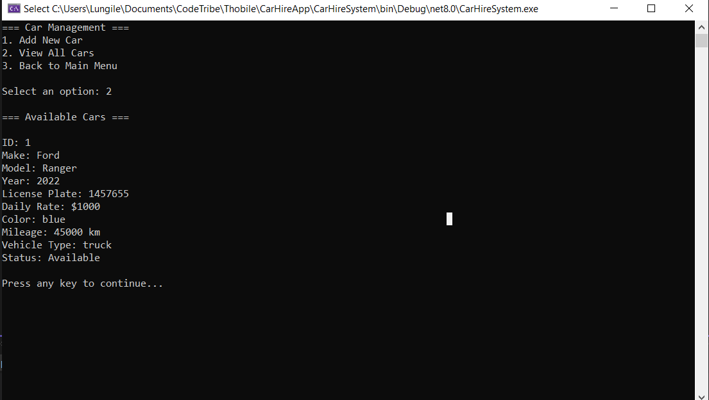

# Car Hire System

A simple **console-based C# application** that allows users to manage car rental information. This project demonstrates basic object-oriented programming concepts and menu-driven interactions in a terminal interface.

## 🚀 Features

- Add new cars to the system
- View a list of all available cars
- Navigate via a menu-based console interface

## 🖥️ Sample Output

=== Car Management ===

    Add New Car

    View All Cars

    Back to Main Menu

## 📂 Folder Structure

## 🛠️ Technologies Used

- C# (.NET 8)
- Console Application
- Visual Studio

## 🏃‍♂️ How to Run

1. Open the project in **Visual Studio**.
2. Build the solution: `Build > Build Solution` (or press `Ctrl+Shift+B`)
3. Run the application: `Debug > Start Debugging` (or press `F5`)

> ⚠️ Ensure the `.NET SDK` is installed and your environment is set up.

## 🔧 Troubleshooting

- **Error**: `dotnet : The term 'dotnet' is not recognized...`  
  **Solution**: Add the .NET SDK to your system PATH or reinstall it from: https://dotnet.microsoft.com/download

---

## 📸 Screenshot

---

## 📃 License

MIT License – feel free to use and modify this code.
